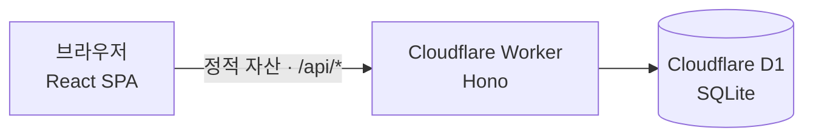

# moizyo — 모이죠

**링크 하나로 끝내는 모임 시간 조율.**
투표를 만들어 링크를 공유하면, 참석자들은 서로의 응답을 보지 못한 채 각자 가능한 시간을
표시합니다. 히트맵과 추천 후보를 바탕으로 최적의 시간을 확정하고, 근거가 담긴 안내
메시지까지 한 번에 공유할 수 있습니다.

**👉 지금 사용해 보기: [moizyo.hseoyeong-design.workers.dev](https://moizyo.hseoyeong-design.workers.dev)**

## 왜 만들었나

When2meet 같은 기존 도구는 시간을 "가능 / 불가능" 둘로만 나눕니다. 하지만 실제 조율에서
중요한 건 그 사이의 회색지대예요 — *"되긴 하는데, 그 시간은 좀…"* moizyo는 이 미묘한
선호를 다루기 위해 만들어졌습니다.

- **비선호 시간 입력** — "가능"과 별개로 "가능하지만 비선호하는 시간"을 표시할 수 있어,
  단순 가용성이 아니라 만족도가 높은 시간을 찾습니다.
- **응답 비공개** — 응답하는 동안 다른 참석자의 응답이 보이지 않습니다. 눈치 보며
  다수에 맞추는 전략적 응답을 막고 솔직한 답을 유도합니다. 비선호 표시는 확정 후에도
  다른 참석자에게 공개되지 않습니다.
- **근거 있는 추천** — 예상 소요 시간만큼 이어지는 연속 시간대를 후보로 계산합니다.
  필수 참석자가 모두 가능한 시간을 우선하고, 가능한 인원이 많은 순으로 추천합니다.
- **확정 메시지 자동 생성** — 확정한 시간과 선정 근거("8명 중 7명 가능" 등)를 담은
  공유용 메시지를 만들어 줍니다. 재조율 요청과 "왜 이 시간이에요?"를 줄입니다.

## 사용 흐름

1. **주최자**: 모임 이름, 예상 소요 시간, 투표할 날짜(또는 요일)와 시간대를 골라 투표를
   만들고 링크를 공유합니다. 회원가입이 없습니다.
2. **참석자**: 링크를 열어 이름과 비밀번호(응답 수정용)를 입력하고, 타임테이블을
   드래그해 가능한 시간과 비선호 시간을 칠합니다. 같은 이름이 여러 명이어도 각자의
   비밀번호로 구분되므로 동명이인도 문제없습니다.
3. **주최자**: 응답이 모이면 히트맵으로 전체 가용 시간을 확인하고, 추천 후보 중에서
   시간을 확정한 뒤 안내 메시지를 복사해 공유합니다. 소요 시간과 필수 참석자는 결과
   화면에서 언제든 바꿔서 다시 추천받을 수 있습니다.

## 아키텍처

Cloudflare Worker 하나가 SPA 정적 파일과 REST API를 함께 서빙하는 단일 배포 구성입니다.



| 계층 | 기술 |
| --- | --- |
| 프런트엔드 | React 19 · TypeScript · Vite |
| API | Hono on Cloudflare Workers |
| 데이터베이스 | Cloudflare D1 (SQLite 호환) |
| 배포 | GitHub → Cloudflare Workers Builds 자동 배포 |

설계상 특징 몇 가지:

- **응답 비밀번호**는 계정이 아니라 "내 응답 수정 권한"입니다. WebCrypto PBKDF2로
  해시해 저장하고, 원문은 어디에도 남지 않습니다.
- **동명이인 처리** — 응답은 이름이 아니라 행 단위 식별자로 구분됩니다. 같은 이름의
  응답이 여러 개면 이름+비밀번호 조합으로 자신의 응답을 찾습니다.
- **D1은 SQLite 방언**이라 `wrangler d1 export` 한 번으로 다른 인프라(VPS의 SQLite 등)로
  옮길 수 있습니다. 무료 티어로 시작해도 잠금이 없습니다.

## 프로젝트 구조

```
├── client/            # React SPA (Vite)
│   └── src/
│       ├── pages/     # 생성 → 공유 → 응답 → 결과 화면
│       ├── components/
│       └── lib/       # API 클라이언트, 추천·히트맵 계산
├── worker/            # Cloudflare Worker (프로덕션 백엔드)
│   ├── src/           # Hono 라우트, 인증, 검증
│   ├── migrations/    # D1 스키마
│   └── wrangler.jsonc
├── DEPLOY.md          # 배포·운영 가이드
└── project/, chats/   # 초기 디자인 프로토타입 (참고용)
```

## 로컬에서 실행하기

로컬 D1(내 컴퓨터 안의 SQLite)을 쓰므로 실서비스 데이터에 영향이 없습니다.

```bash
# 1) API + 로컬 DB
cd worker
npm install
npx wrangler d1 migrations apply moizyo --local   # 최초 1회
npm run dev                                        # http://localhost:8787

# 2) 클라이언트 (별도 터미널, 저장 즉시 반영)
cd client
npm install
npm run dev                                        # http://localhost:5173
```

빌드된 결과물로 프로덕션과 동일하게 확인하려면 `cd client && npm run build` 후
http://localhost:8787 을 열면 됩니다.

## 배포

`main` 브랜치에 푸시하면 Cloudflare Workers Builds가 자동으로 빌드·배포합니다.
다른 브랜치에 푸시하면 프로덕션에 반영되지 않는 프리뷰 버전이 만들어집니다.
초기 설정과 백업 등 운영 방법은 [DEPLOY.md](DEPLOY.md)를 참고하세요.
